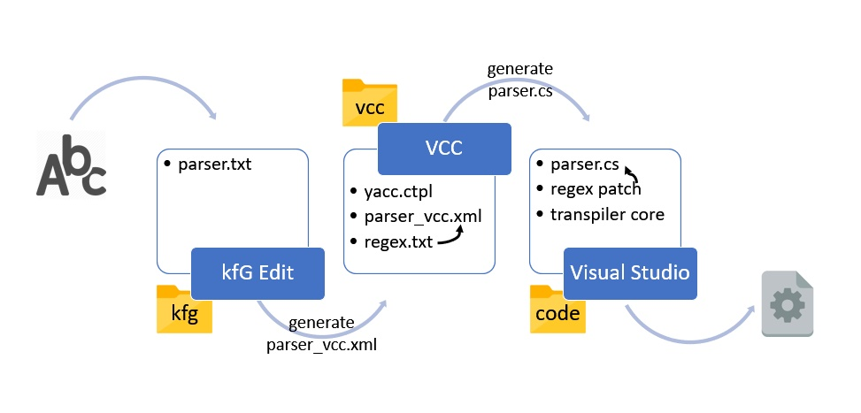
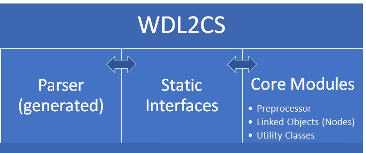
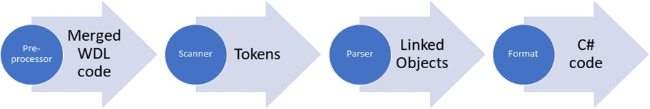

# WDL2CS

WDL to C# transpiler for Acknex3 Engine

## What is this?

This is a playground project for some work with context free grammar and compiler building. It takes the WDL syntax of the long abandoned Acknex3 raycaster engine as input. It may in far future be added to [Wm3Util](https://github.com/firoball/Wm3Util) in order to achieve a more complete conversion of Ackex3 levels for Unity. That's a huge step to take, though, so don't expect it to happen in the near future.

## How does it work?

WDL2CS makes use of the freely available [AtoCC](https://atocc.de) toolchain which is based on the [TP Lex/Yacc](https://github.com/martok/fpc-tply) compiler.
Workflow is as follows:

__Important:__ At this very early stage the transpiler __does not do anything productive__ yet. It can be tested against actual WDL files in order to verify whether parsing works as intended or not.
The generated code can be compiled againat my [Acknex3 C# Api](https://github.com/firoball/AcknexCSApi) project and reviewed for syntax errors.

## Step by step instruction

### Preparation

* Download and install [AtoCC](https://atocc.de) tool chain. The included tools **kfgEdit** and **VCC** will be used for generation.
* Copy `vcc\yacc.ctpl` to same folder where your **vcc.exe** is located. Make sure to keep a backup of the original file.
* The optimized parser requires some manual patching and recompilation. For easier patching you can add the Notepad++ macro `meta\regex_helpers\regex_npp_macro.xml` to your `shortcuts.xml` (requires **Notepad++**). 
* Install a recent version of [Microsoft Visual Studio](https://visualstudio.microsoft.com/de/downloads/) (Community edition for C#).

### Workflow

The AtoCC tool chain is pretty limited. With this transpiler getting more and more complex, several manual patches were required to be introduced in the somewhat tedious build process.
Below, a step by step list is provided in order to get a successful compile done.
The transpiler turned out to be very slow, which was a major roadblock. It showed, that the code generator produces very inefficient code. Unfortunately, that part is hardcoded into **VCC**, therefore some more manual patching was introduced. The optimized version processes large chunks of `.wdl` files in some seconds, whereas the non-optimized version takes minutes.

#### Grammar

* Define grammar in `kfg\parser.txt`
* Open **kfgEdit** and load `kfg\parser.txt`.
* Hit **Export Compiler** and save `vcc\parser_vcc.xml`. **VCC** will open automatically.

#### Tokenizer and Generator

* If not open, start **VCC** and load `vcc\parser_vcc.xml`. Make sure compile option for **C#** is set.
* Hit **Create Compiler** and check for any reported conflicts. Don't save any code yet.
* Save `vcc\parser_vcc.xml`.
* Open `vcc\parser_vcc.xml` in text editor of choice.
* Apply any new regular expressions to `vcc\regex.txt`.
* Copy contents of `vcc\regex.txt` to `vcc\parser_vcc.xml` between `<scanner>..</scanner>` tags.
* Save `vcc\parser_vcc.xml` and reload file in **VCC**.
* Hit **Create Compiler** and save generated code to `code\parser.cs`. **VCC** will abort compilation due to a `#warning` pragma. This is intended.

#### Patch optimized transpiler

* Locate _FindToken_ function in `code\parser.cs`.
* Copy all `if (Regex.IsMatch(..){..}` statements into a new file in **Notepad++**. Make sure order remains as generated.
* Run the **WDL2CS** macro (see _preparation_ chapter) and copy the result to clipboard.
* Locate line `#warning Place tList and rList init in MyCompiler(){} (...)` in `code\parser.cs`.
* Replace with previously copied content and save.

**Required for advanced modifications only:**
In case further changes to `code\parser.cs` are required, the updated template file `vcc\yacc.ctpl` has to be modified accordingly and afterwards copied to same folder as `vcc.exe` (admin rights required).
Using this method, manual patching to `parser.cs` after compiling the transpiler core can be kept to the unavoidable minimum.

#### Compile transpiler

* Open `code\WDL2CS Transpiler.sln` in **Visual Studio** and build project.

#### Run transpiler

* Run `parser <file>` or `parser -t <file>` (for listing all identified tokens) from command line.
* An example for parsing through all files in a specific folder is provided: `test\test.bat`
* If preferred, output can be redirected to file (append `> out.cs` to command line) or output file name can be provided as additional parameter.

For automated transpiling and (regression) testing larger amounts of WDL files the [WDL Transpiler Testsuite] (https://github.com/firoball/WDLTransTest) can be used.

## Architecture and Workflow 

The parser code is generated through **VCC** tool (and manually patched afterwards). Any function hooked in the parser configuration file is strictly provided by a static interface class.
Behind the static layer the actual core of the transpiler is abstracted. These parts are maintained manually and unrelated to the workflow of the **VCC** tool.

First, the preprocessor is executed. It merges all referenced WFL files into a single one, discards disabled parts due to preprocessor defines. Replacement preprocessor directives are resolved.
The preprocessed WDL file is handed over to the parser.
The parser uses a node system, in order to link all objects in correct order during parsing. Using this method expensive recursive string concating is avoided.
Once all incoming tokens have been processed, the whole node structure is processed. During this phase each object, property and instruction is translated to C# syntax following individual rules. 
At the end of this phase the script is complete.
The last step is responsible for formatting all objects, the corresponding C# code is generated.

## Current status

The transpiler successfully parses and accepts WDL files of ten different games. After hitting very long execution times due to intense regex usage, the transpiler code generated by **VCC** was reviewed and optimized.
Due to the limits of [AtoCC](https://atocc.de), manual patches are required in several places of the build process.

## Next steps

High-level road map:
* [x] define grammar and token regex
* [x] define WDL API for C# (separate project, in progress)
* [x] add token to script generator logic
* [x] export C# scripts
* [x] test exported code against AcknexCSApi
* [x] automated regression tests, see [WDLTransTest](https://github.com/firoball/WDLTransTest)
* [x] introduce preprocessor
* [x] remove preprocessor defines from grammar
* [x] simplify grammar, reduce regex cases (performace boost)
* [x] introduce regex-based identifier class (performace boost)
* [x] replace serialization with linked nodes (performace boost)
* [x] test transpiler against all available Acknex3 games
* [x] handle reuse of keywords (duplicates)
* [x] strip trailing bogus code from files in Preprocessor
* [x] add optional support for property string list export 
* [ ] Cleanup NodeFormatter - allow late formatting <-- __HERE__
* [ ] Support WDL output aditionally to CS
* [ ] fix naming edge cases for property string lists

## Compatibility

Following Acknex3 games have been transpiled and compiled against [Acknex3 C# Api](https://github.com/firoball/AcknexCSApi) successfully:

* Abiventure 2 (Crew99)
* Adeptus (Conitec)
* Angst (ManMachine Games)
* Bust Hillary (Dan Pereira)
* Deathman's Island (Lutz Hüls)
* Der Name des Bruders (backbone.interactive)
* Escape (Ben Glick)
* Floriansdorf (BigByte Software)
* Hades 2 (Espaço Informática)
* Lord of Lightning (Alex Seifriz)
* Mr. Pibb (BrandGames)
* Mystic Office (Czeslaw Gorski)
* Nightfreeze (Dennis Lenz)
* oPDemo3 (oP Group Germany)
* Saints of Virtue (Shine Studios)
* Shadow of the Lost Citadel (SalsaShark Productions)
* Skaphander Demo (oP Group Germany)
* Streetlife (Madhouse Games)
* Tasty Temple Challenge (BrandGames)
* Tyrannizer Demo (Viper Byte Software)
* Vampira (CWR-Spiele)
* Varginha Incident / Alien Anarchy (Perceptum Informática)
* Virus Explosion (oP Group Germany)
* VRDemo (oP Group Germany)
* VVL (CWR-Spiele) 
* War Pac 3D (SKV Soft)
* World of Kandoria - Contest version (mine)

Following Acknex3 games have been transpiled, but don't compile:

* Black Bekker (Min Bekker) - Game utilizes jumps into if-cases which is not supported by C#
* Skaphander (oP Group Germany) - Name clashes between different object types and actions
* VR Messe (oP Group Germany)  - Name clashes between different object types and actions

Following Acknex3 games currently are **not** supported by the transpiler:

* N/A

Games I am looking forward to get hold of for testing:

* Adventure Demo (Conitec GmbH) - is this same as Adeptus?
* Banana Kong (Lutz Hüls)
* Pax Westphalica (M.T. Bhatty)
* Pikto (Phaestos)
* Queste (oP Group Germany)
* Shades (LifeGbR)
* Timetrap 3D (Michael Meyer)
* other A3 games I am not aware of

Source code is not freely available for all of the listed games, therefore transpiled code is not uploaded to GitHub.

## Legal stuff

Please respect [license.txt](license.txt) (Attribution-NonCommercial 4.0 International)

-firoball

[https://firoball.de](https://firoball.de)
